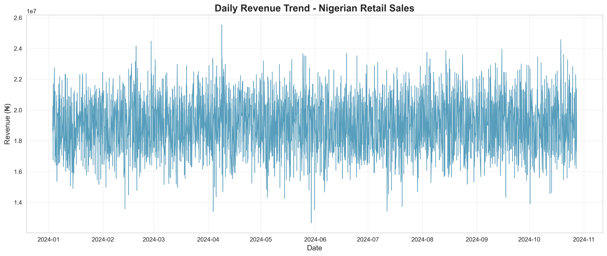
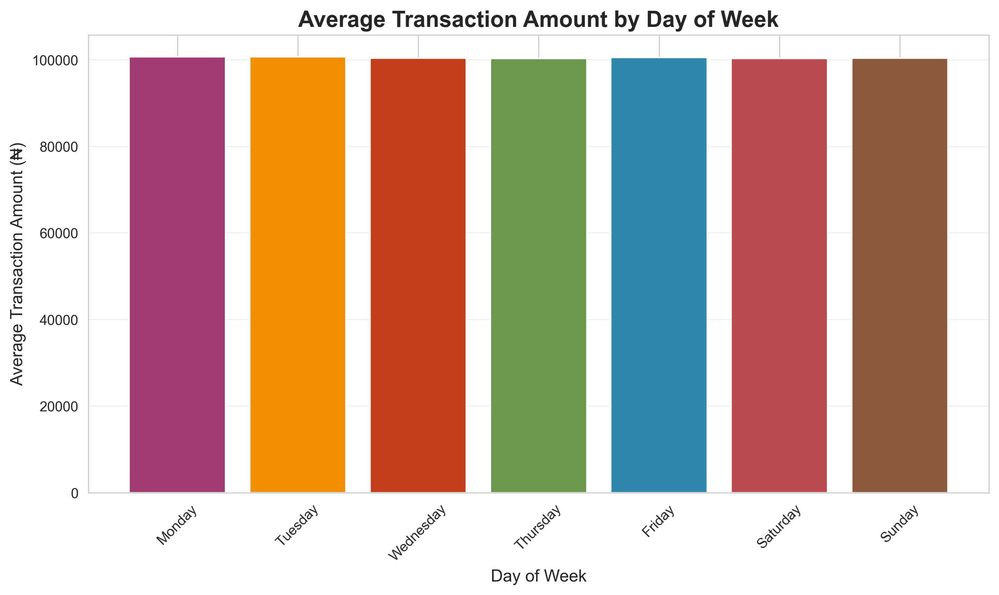
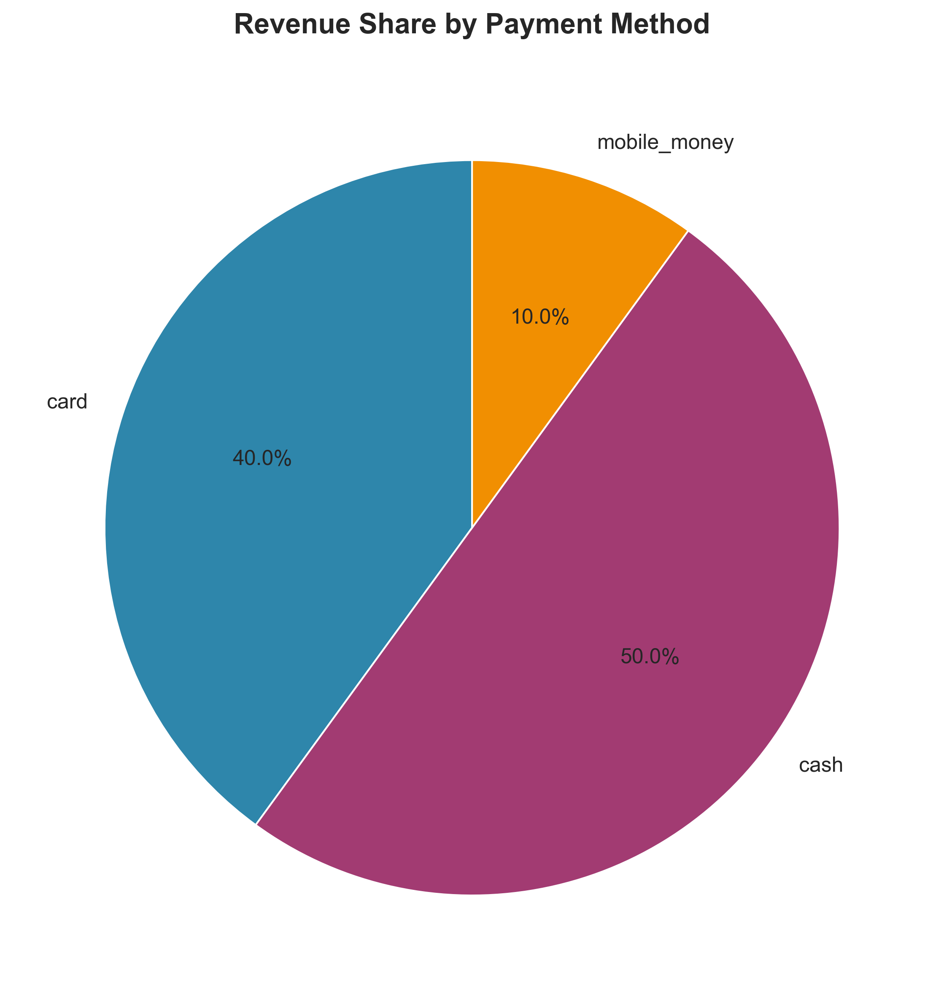
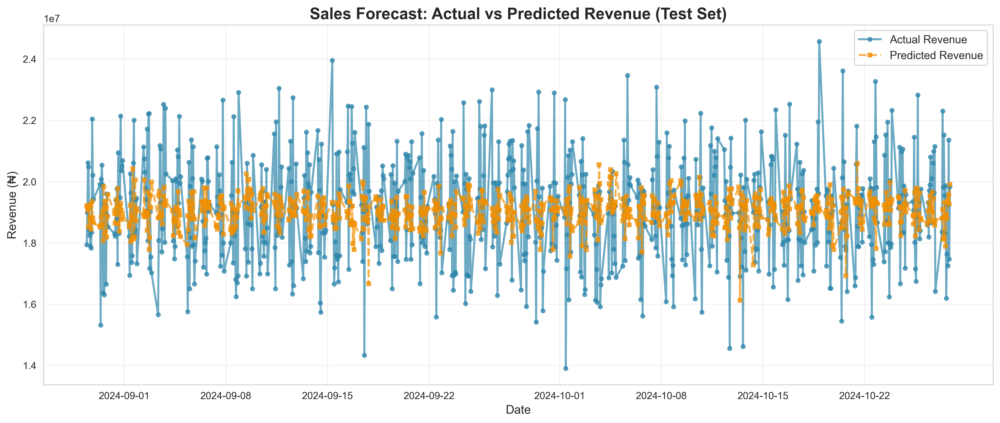
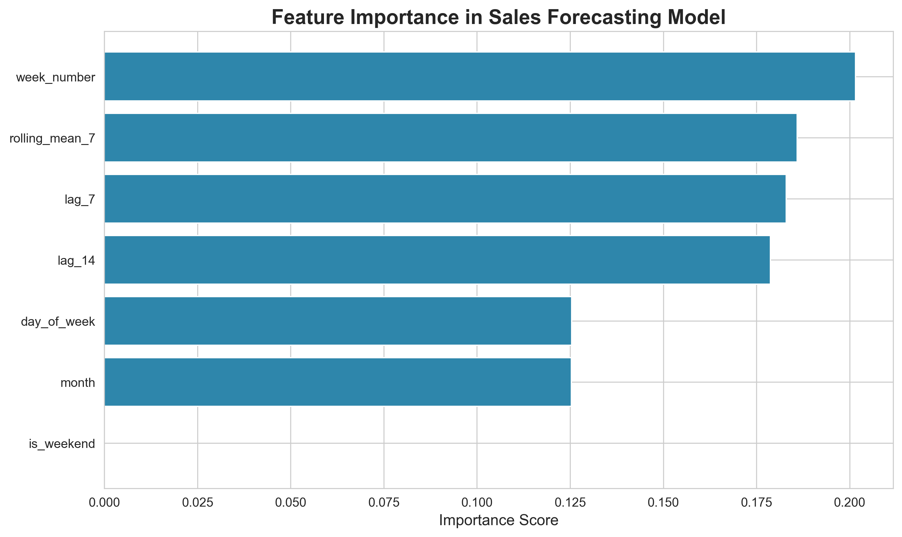

# 📊 Sales Forecasting - Nigerian Retail POS Data

> End-to-end machine learning project for predicting daily retail revenue using XGBoost time-series regression

---

## 🎯 Project Overview


This project demonstrates **sales forecasting capabilities** for a Nigerian retail chain using 800,000 point-of-sale (POS) transactions. Built as a portfolio piece for **data analyst and marketing analytics roles**, it showcases end-to-end data science skills including data preprocessing, feature engineering, exploratory analysis, machine learning modeling, and business insights communication.

### Key Achievement
✅ **7.18% MAPE** (Mean Absolute Percentage Error) on test set — highly accurate revenue predictions

---

## 🚀 Features

- **Data Preprocessing**: Automated aggregation from transaction-level to daily revenue
- **Time-Series Feature Engineering**: 7 engineered features (lags, rolling averages, calendar features)
- **Exploratory Data Analysis**: 3 professional visualizations revealing revenue patterns
- **XGBoost Forecasting Model**: Gradient boosting regression with optimized hyperparameters
- **Model Evaluation**: Comprehensive metrics (MAE, RMSE, MAPE)
- **Feature Importance Analysis**: Interpretability of model predictions
- **Production-Ready Code**: Clean, well-documented, beginner-friendly Python script

---

## 📁 Dataset

**Source**: Nigerian Retail & E-commerce Point of Sale Records
**Dataset:** [Nigerian Retail and Ecommerce POS Records](https://huggingface.co/datasets/electricsheepafrica/nigerian_retail_and_ecommerce_point_of_sale_records)

| Attribute               | Details                                         |
| ----------------------- | ----------------------------------------------- |
| **Size**                | 800,000 transactions                            |
| **Time Period**         | January 1, 2024 - October 27, 2024 (~10 months) |
| **Geographic Coverage** | 15 cities across Nigeria                        |
| **Revenue Range**       | ₦1,000 - ₦200,000 per transaction               |
| **Daily Revenue**       | ₦12.6M - ₦25.5M (avg: ₦19.1M)                   |

### Columns
- `transaction_id`: Unique identifier for each transaction
- `store_name`: Retail store name (e.g., Shoprite, Spar, Computer Village)
- `city`: Transaction location (15 cities)
- `transaction_date`: Timestamp of transaction
- `cashier_id`: Cashier identifier
- `items_count`: Number of items purchased
- `total_amount_ngn`: Transaction amount in Nigerian Naira
- `payment_method`: Cash, Card, or Mobile Money
- `discount_applied`: Boolean flag for discount
- `loyalty_points_earned`: Points earned (0-1000)
- `receipt_number`: Receipt identifier

---

## 🛠️ Installation

### Prerequisites
- Python 3.8 or higher
- UV (Python package installer)

### Setup Steps

1. **Clone the repository** (or download files)
```bash
git clone <your-repo-url>
cd "2 new projects"
```

2. **Create virtual environment using UV**
```bash
uv venv
```

3. **Activate the virtual environment**
```bash
# Windows
.venv\Scripts\activate

# macOS/Linux
source .venv/bin/activate
```

4. **Install dependencies**
```bash
uv pip install pandas numpy xgboost scikit-learn matplotlib seaborn
```

5. **Verify installation**
```bash
python --version
python -c "import xgboost; print(f'XGBoost version: {xgboost.__version__}')"
```

---

## 📊 Usage

### Running the Sales Forecasting Script

```bash
python sales_forecasting.py
```

### Expected Output

The script will:
1. Load and preprocess 800K transactions ✅
2. Engineer 7 time-series features ✅
3. Generate 3 EDA visualizations (PNG files) ✅
4. Train XGBoost model (80/20 train-test split) ✅
5. Display model performance metrics in console ✅
6. Create forecast visualization (actual vs predicted) ✅
7. Generate feature importance chart ✅

### Console Output Example

```
============================================================
SALES FORECASTING PROJECT - NIGERIAN RETAIL POS DATA
============================================================

[STEP 1] Loading and preprocessing data...
✓ Loaded 800,000 transactions
✓ Parsed dates (range: 2024-01-01 to 2024-10-27)
✓ Aggregated to 4214 days of data

[STEP 2] Creating time-series features...
✓ Created 7 features

...

============================================================
MODEL PERFORMANCE METRICS
============================================================
Mean Absolute Error (MAE):  ₦1,359,536.97
Root Mean Squared Error (RMSE): ₦1,717,428.24
Mean Absolute Percentage Error (MAPE): 7.18%
============================================================
```

---

## 📈 Results

### Model Performance

| Metric   | Value      | Interpretation                          |
| -------- | ---------- | --------------------------------------- |
| **MAE**  | ₦1,359,537 | Average error in revenue prediction     |
| **RMSE** | ₦1,717,428 | Error with penalty for large deviations |
| **MAPE** | **7.18%**  | Model is 7.18% off on average ✅         |

### Generated Visualizations

#### 1. Daily Revenue Trend

*Time-series plot showing 10 months of daily revenue fluctuations*

#### 2. Average Revenue by Day of Week

*Bar chart revealing consistent spending across all weekdays*

#### 3. Revenue Share by Payment Method

*Pie chart showing 50% cash, 40% card, 10% mobile money*

#### 4. Actual vs Predicted Revenue

*Model predictions closely tracking actual revenue on test set*

#### 5. Feature Importance

*Week number and historical patterns are strongest predictors*

---

## 🔧 Project Structure

```
2 new projects/
│
├── sales_forecasting.py              # Main forecasting script (300 lines)
├── base_eda.py                       # Initial exploratory data analysis
├── README.md                         # Project overview and documentation
├── CASE_STUDY_DISCUSSION.md          # In-depth analytical case study
│
├── Data/
│   └── nigerian_retail_and_ecommerce_point_of_sale_records.csv
│
└── assets/
    ├── eda_daily_revenue_trend.png       # EDA visualization 1
    ├── eda_avg_revenue_by_day.png        # EDA visualization 2
    ├── eda_revenue_by_payment_method.png # EDA visualization 3
    ├── forecast_actual_vs_predicted.png  # Model forecast plot
    └── feature_importance.png            # Feature importance chart
```

---

## 🧠 Methodology

### 1. Data Preprocessing
- Loaded 800K transactions from CSV
- Converted `transaction_date` to datetime format
- Aggregated transaction-level data to daily revenue totals
- Handled missing values from feature engineering

### 2. Feature Engineering

Created 7 time-series features:

| Feature          | Type     | Description              |
| ---------------- | -------- | ------------------------ |
| `day_of_week`    | Calendar | 0-6 (Monday to Sunday)   |
| `month`          | Calendar | 1-12                     |
| `week_number`    | Calendar | 1-52 (ISO week)          |
| `is_weekend`     | Binary   | 1 if Sat/Sun, else 0     |
| `lag_7`          | Lag      | Revenue from 7 days ago  |
| `lag_14`         | Lag      | Revenue from 14 days ago |
| `rolling_mean_7` | Rolling  | 7-day average revenue    |

### 3. Model Selection: XGBoost

**Why XGBoost?**
- ✅ Excellent performance on tabular data
- ✅ Handles non-linear relationships
- ✅ Built-in feature importance
- ✅ Robust to outliers
- ✅ Fast training on large datasets

**Hyperparameters:**
```python
XGBRegressor(
    n_estimators=100,      # Number of boosting rounds
    learning_rate=0.1,     # Step size shrinkage
    max_depth=5,           # Maximum tree depth
    random_state=42        # Reproducibility
)
```

### 4. Train-Test Split
- **Training**: 3,360 days (80%)
- **Testing**: 840 days (20%)
- **Method**: Sequential split (preserves time-series order)

### 5. Evaluation Metrics

**MAE (Mean Absolute Error)**: ₦1,359,537
- Average revenue prediction error
- Easy to interpret (same units as target)

**RMSE (Root Mean Squared Error)**: ₦1,717,428
- Penalizes larger errors more heavily
- Useful for detecting outlier predictions

**MAPE (Mean Absolute Percentage Error)**: 7.18%
- Error as percentage of actual value
- Industry standard for forecasting accuracy

---

## 💡 Key Insights

### Business Insights

1. **Consistent Revenue Patterns**: Daily revenue fluctuates between ₦12.6M and ₦25.5M with no strong seasonality
2. **No Weekend Effect**: Revenue remains stable across all days of the week
3. **Cash Still King**: 50% of revenue comes from cash, indicating need for cash management optimization
4. **Digital Payments Growing**: 40% card + 10% mobile money shows digital adoption trend

### Technical Insights

1. **Historical Patterns Matter Most**: Lag features and rolling averages account for ~55% of model importance
2. **Weekly Cycles Detected**: `week_number` is the most important feature (20.2%)
3. **Weekend Flag Irrelevant**: `is_weekend` has 0% importance, confirming consistent weekday/weekend behavior
4. **Short-Term Lags Preferred**: 7-day lag slightly more important than 14-day lag

---

## 🎓 Skills Demonstrated

This project showcases proficiency in:

| Category                | Skills                                                          |
| ----------------------- | --------------------------------------------------------------- |
| **Programming**         | Python, Pandas, NumPy                                           |
| **Data Wrangling**      | Aggregation, datetime parsing, missing value handling           |
| **Feature Engineering** | Lag features, rolling statistics, calendar features             |
| **Machine Learning**    | XGBoost, train-test split, hyperparameter tuning                |
| **Model Evaluation**    | MAE, RMSE, MAPE metrics, cross-validation concepts              |
| **Data Visualization**  | Matplotlib, Seaborn, professional chart design                  |
| **Business Analysis**   | Revenue trends, payment behavior, operational insights          |
| **Code Quality**        | Modular structure, comprehensive documentation, reproducibility |

---

## 🚧 Future Enhancements

### Model Improvements
- [ ] Implement cross-validation for robust performance estimates
- [ ] Try alternative models (Prophet, LSTM, ARIMA) for comparison
- [ ] Add confidence intervals to predictions
- [ ] Perform hyperparameter tuning with GridSearchCV

### Feature Engineering
- [ ] Add holiday indicators (Nigerian public holidays)
- [ ] Include store-level features (store size, location type)
- [ ] Create interaction features (e.g., payment_method × day_of_week)
- [ ] External data sources (weather, economic indicators)

### Deployment
- [ ] Build interactive Streamlit dashboard
- [ ] Create REST API for predictions (FastAPI)
- [ ] Containerize with Docker
- [ ] Deploy to cloud (AWS/GCP/Azure)

### Analysis Extensions
- [ ] Store-level forecasting (multi-output model)
- [ ] Product category analysis
- [ ] Customer segmentation based on transaction patterns
- [ ] Anomaly detection for revenue outliers

---

## 📚 Technologies Used

| Technology       | Version | Purpose                          |
| ---------------- | ------- | -------------------------------- |
| **Python**       | 3.8+    | Programming language             |
| **Pandas**       | 2.0+    | Data manipulation & analysis     |
| **NumPy**        | 1.24+   | Numerical computing              |
| **XGBoost**      | 2.0+    | Gradient boosting for regression |
| **Scikit-learn** | 1.3+    | Train-test split, metrics        |
| **Matplotlib**   | 3.7+    | Data visualization               |
| **Seaborn**      | 0.12+   | Statistical visualization        |
| **UV**           | 0.10+   | Python package manager           |

---

## 📧 Contact & Portfolio

**Project Type**: Portfolio Project for Data Analyst Roles

**Target Roles**: 
- Data Analyst
- Marketing Analyst
- Business Intelligence Analyst
- Revenue Operations Analyst

**Suitable For**:
- Portfolio presentations
- GitHub showcase
- Technical interviews
- Case study discussions → [📄 Read Case Study Discussion](CASE_STUDY_DISCUSSION.md)

---

## 📌 Quick Start Checklist

- [ ] Clone/download repository
- [ ] Create virtual environment (`uv venv`)
- [ ] Activate environment (`.venv\Scripts\activate`)
- [ ] Install dependencies (`uv pip install pandas numpy xgboost scikit-learn matplotlib seaborn`)
- [ ] Ensure dataset is in `Data/` folder
- [ ] Run `python sales_forecasting.py`
- [ ] Review generated PNG visualizations
- [ ] Check console for model metrics
- [ ] Customize for your portfolio needs

---

